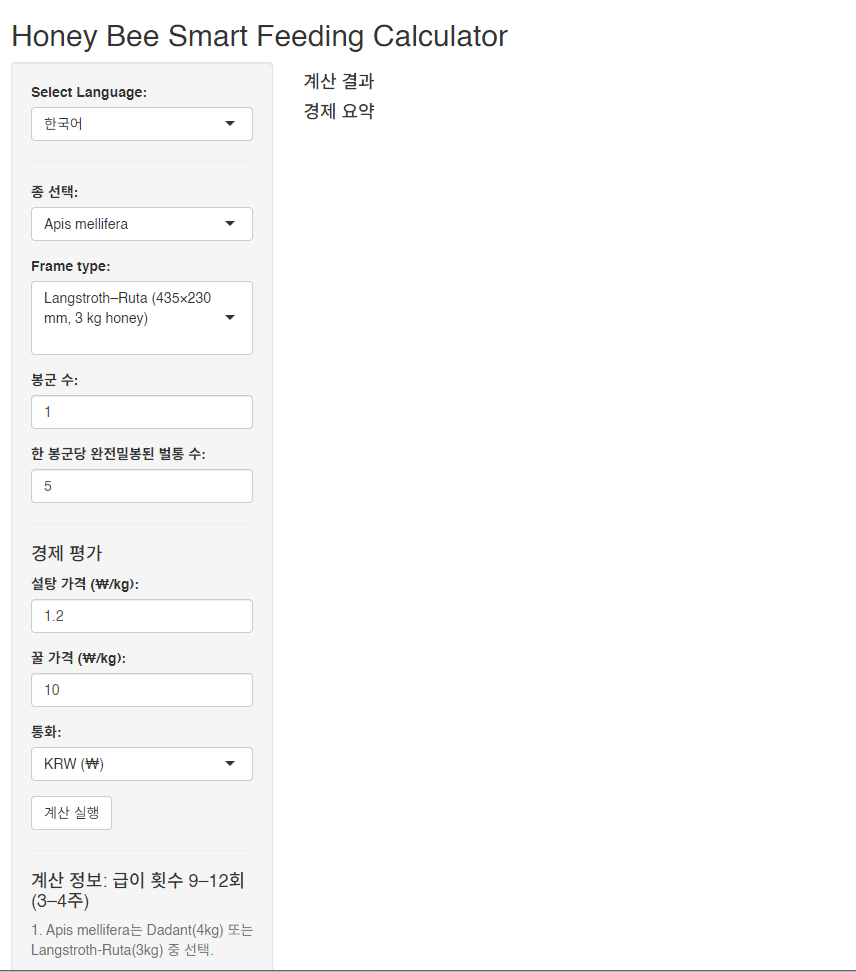
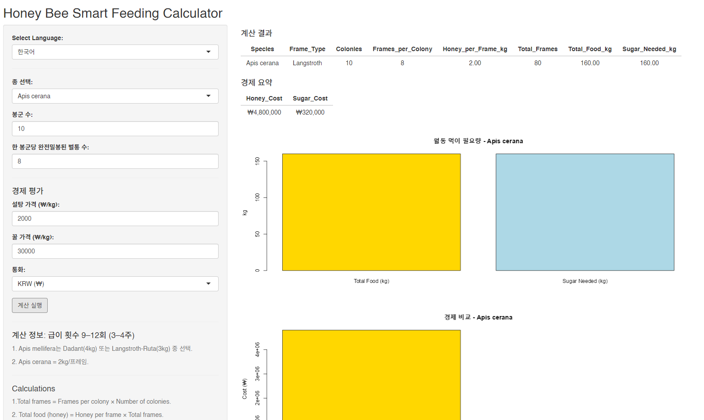
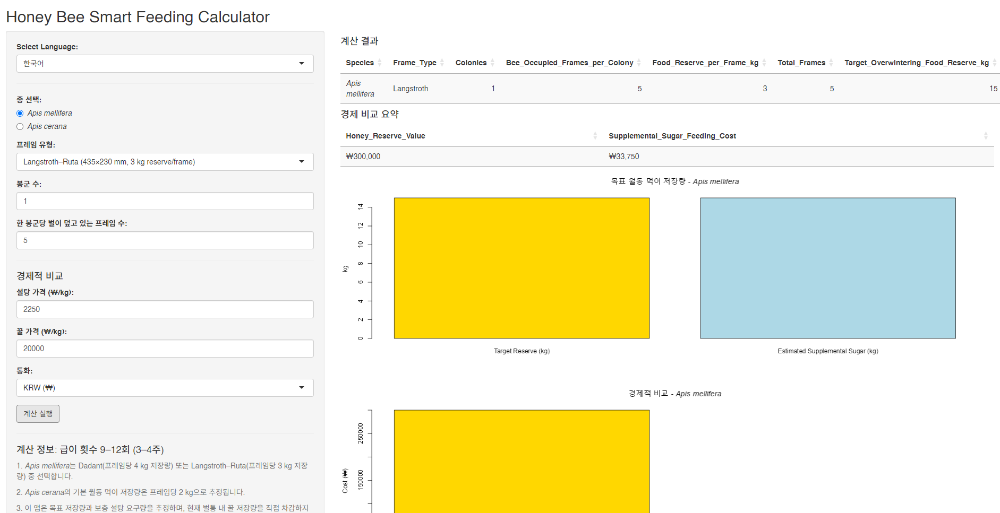

# Honey Bee Smart Feeding Calculator
# 월동 전 급이 관리 의사결정 지원 도구

## 개요

**Honey Bee Smart Feeding Calculator**은 월동 전 꿀벌 봉군의 식량 저장량 요구량과 급이 비용을 추정하기 위해 개발된 무료 R Shiny 기반 인터랙티브 애플리케이션입니다.

본 애플리케이션은 다음 두 종을 지원합니다:

- *Apis mellifera* (서양꿀벌)
- *Apis cerana* (동양꿀벌)

사용자는 다음 항목을 추정할 수 있습니다.
- 목표 월동 식량 저장량
- 저장량 기준 설탕 급이 요구량
- 예상 설탕 급이 비용
- 동등한 벌꿀 저장량의 시장 가치
- 설탕 급이 비용과 벌꿀 저장 가치 간 경제성 비교
본 도구는 다음 목적을 위해 개발되었습니다.
- 실용 양봉
- 교육 목적
- 월동 계획 수립
- 월동 급이 전략의 경제성 비교
- 연구 및 기술지도 활동

---

## 과학적 배경

꿀벌 봉군의 성공적인 월동은 충분한 식량 저장량과 적절한 봉군 세력 유지에 크게 의존합니다. 급이 전략은 꿀벌 종, 기후, 사양 체계 및 지역 양봉 관행에 따라 달라집니다.

**Honey Bee Smart Feeding Calculator**는 다음 항목을 쉽고 투명하게 추정할 수 있도록 개발되었습니다.

- 월동 식량 저장량 요구량
- 저장량 기반 설탕 급이 요구량
- 관련 급이 비용
- 월동 식량 관리에 따른 관리적·경제적 고려사항
  
본 계산기는 문헌에 보고된 양봉 관리 지침과 실제 양봉 현장의 경험적 권장사항을 바탕으로 한 종별 식량 저장량 기준값을 사용합니다. 본 도구는 의사결정을 지원하기 위한 참고 도구이며, 직접적인 봉군 검사나 전문 양봉가의 판단을 대체하지 않습니다.
중요하게도, 본 계산기는 천연 벌꿀 저장량을 설탕 시럽으로 대체하도록 권장하기 위해 개발된 것이 아닙니다. 오히려 월동 식량 저장량이 부족하여 보충 급이가 필요한 상황에서 의사결정을 지원하기 위한 도구입니다.

---

## 설치 방법

### 1. R 설치

https://cran.r-project.org/

### 2. RStudio 설치 (선택 사항)

https://posit.co/download/rstudio-desktop/

### 3. 필수 패키지 설치

패키지 설치를 위해 “RUN1_pre.R” 파일을 실행하십시오.

### 4. 애플리케이션 실행

RStudio에서 "RUN2_app.R" 파일을 실행한 후 Run App 버튼을 클릭하십시오.

또는 아래 명령어를 실행하십시오:

shiny::runApp()

---

## 사용 방법

### 1단계 — 꿀벌 종 선택

- A = *Apis cerana*
- B = *Apis mellifera*

### 2단계 — 군집 정보 입력

- 군집당 벌집 프레임 수
- 군집 수
- 설탕 가격 (kg당)
- 꿀 가격 (kg당)

### 3단계 — 계산 실행

- Run calculation

애플리케이션이 계산하는 항목:

- 월동 총 먹이량
- 필요한 총 설탕량
- 예상 설탕 비용
- 예상 꿀 비용

### 4단계 — 결과 확인

결과는 다음 형태로 표시됩니다:

- 데이터 테이블
- 그래프 출력

## 계산 원리
본 계산기는 종별 월동 식량 저장량 기준값을 사용합니다.
종	기준 저장량
- *Apis cerana*	벌집틀당 2 kg
- *Apis mellifera* (Langstroth)	벌집틀당 3 kg
- *Apis mellifera* (Dadant)	벌집틀당 4 kg
  
이 값들은 실제 양봉 관리 지침 및 현장 권장사항에 기반한 일반적인 참고값입니다.
본 애플리케이션은 이러한 종별 기준값을 이용하여 목표 월동 식량 저장량과 이에 상응하는 급이 요구량을 추정합니다.
경제성 계산은 사용자가 입력한 벌꿀 가격과 설탕 가격을 이용하여 수행됩니다.

경제성 지수(Economic Efficiency Ratio)는 다음과 같이 계산됩니다.
설탕 급이 비용 ÷ 벌꿀 저장량 가치

이 값은 다양한 관리 전략의 경제적 비교를 위한 참고 자료이며, 천연 벌꿀 저장량을 설탕 시럽으로 대체하도록 권장하는 의미는 아닙니다.

---

## 제한 사항

본 도구는 근사 추정값만 제공합니다.

다음 요소들은 고려되지 않습니다:

- 지역 기후 차이
- 밀원 가용성
- 군집 유전적 특성
- 질병 상태
- 기생충 압력
- 군집별 월동 성공률
- 시장 가격 변동
- 추가 관리 비용

결과는 현장 관찰 및 지역 양봉 경험과 함께 해석되어야 합니다.

또한 본 애플리케이션은 설탕 급이를 보편적이거나 우수한 양봉 전략으로 광고하거나 권장하지 않습니다. 급이 방식은 지역 환경, 군집 건강 상태, 밀원 조건 및 지역 양봉 관행에 따라 조정되어야 합니다.

---

## 문제 해결

### 패키지가 없는 경우

install.packages("package_name")

### 오래된 R 버전

- R version ≥ 4.0

### Shiny 설치 테스트

library(shiny)
runExample("01_hello")

예제가 정상적으로 실행되면 Shiny가 올바르게 설치된 것입니다.

---

## 인용

본 소프트웨어를 연구에 활용하는 경우 다음과 같이 인용해 주십시오.
Frunze, O., Park, J., Lee, J.-H., Kim, H., Woo, S.O., Han, S.M., & Kwon, H.-W. (2026). Honey Bee Smart Feeding Calculator (Version 1.0). Zenodo. DOI: 10.5281/zenodo.20101912

---

## 라이선스

본 프로젝트는 GNU General Public License v3.0 (GPL-3.0)에 따라 배포됩니다.

---

## 면책 조항

본 소프트웨어는 교육 및 계획 수립 목적만을 위해 제작되었습니다.

계산 결과는 근사값이며 전문 양봉 평가나 직접적인 군집 검사를 대체할 수 없습니다.

---

## 연락처

- Prof. Hyung-Wook Kwon
- 권형욱 교수
인천대학교 생명과학과
대한민국
E-mail: hwkwon@inu.ac.kr

- PhD. Olga Frunze 박사
인천대학교 생명과학과
대한민국
E-mail: frunzeon@gmail.com

## Screenshots

### Main Interface

### Example Calculation

### Results for *Apis cerana*

### Results for *Apis mellifera*

