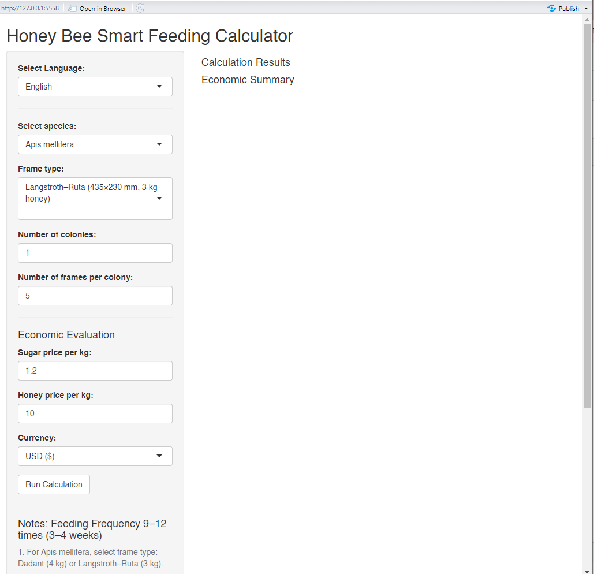
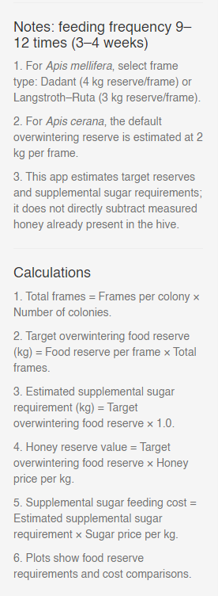
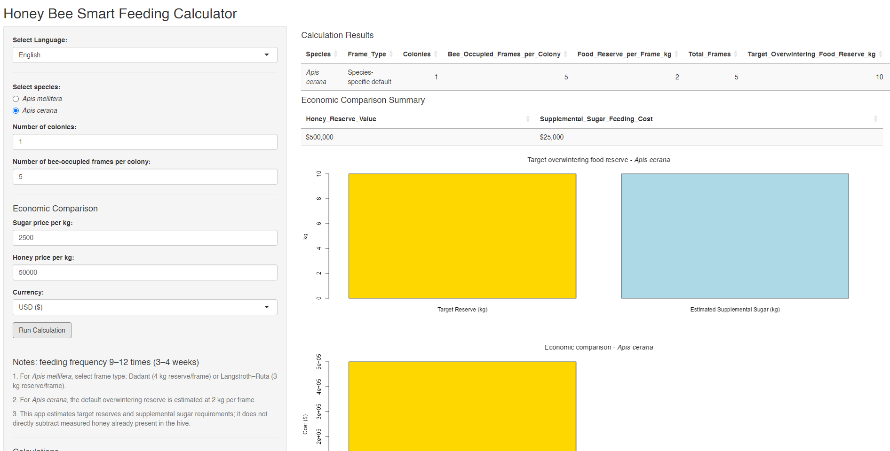
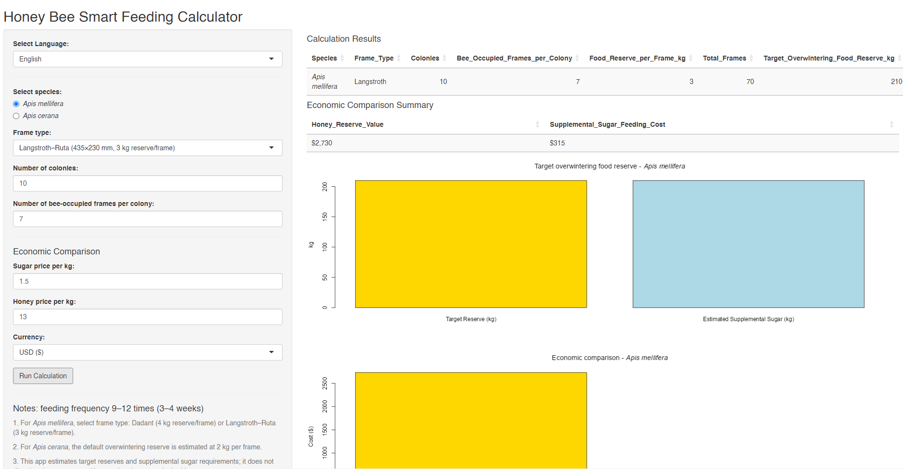

# Honey Bee Smart Feeding Calculator Shiny App

## 개요

**Honey Bee Smart Feeding Calculator Shiny App**은 월동 전 꿀벌 군집의 설탕 급이량과 경제적 비용을 추정하기 위해 개발된 무료 인터랙티브 R Shiny 애플리케이션입니다.

본 애플리케이션은 다음 두 종을 지원합니다:

- *Apis mellifera* (서양꿀벌)
- *Apis cerana* (동양꿀벌)

이 도구를 통해 사용자는 다음 항목을 추정할 수 있습니다:

- 월동에 필요한 총 먹이량
- 50% 설탕 시럽 제조에 필요한 총 설탕량
- 예상 설탕 비용
- 예상 꿀 대체 비용

본 애플리케이션의 목적은 다음과 같습니다:

- 실용 양봉 관리
- 교육 목적
- 월동 계획 수립
- 경제성 평가

---

## 과학적 배경

꿀벌 군집의 성공적인 월동은 충분한 먹이 저장량과 강한 군세에 크게 의존합니다. 급이 관리 전략은 기후, 꿀벌 종, 지역 양봉 전통 및 환경 조건에 따라 달라질 수 있습니다.

본 애플리케이션은 다음을 간단하고 투명하게 추정할 수 있도록 개발되었습니다:

- 군집 먹이 요구량
- 설탕 급이 필요량
- 월동 전략의 경제적 효율성

본 계산기는 실제 양봉 현장에서 일반적으로 사용되는 근사 변환 계수를 기반으로 합니다.

---

## 설치 방법

### 1. R 설치

https://cran.r-project.org/

### 2. RStudio 설치 (선택 사항)

https://posit.co/download/rstudio-desktop/

### 3. 필수 패키지 설치

패키지 설치를 위해 “RUN1_pre.R” 파일을 실행하십시오.

### 4. 애플리케이션 실행

RStudio에서 "RUN2_app.R" 파일을 실행한 후 Run App 버튼을 클릭하십시오.

또는 아래 명령어를 실행하십시오:

shiny::runApp()

---

## 사용 방법

### 1단계 — 꿀벌 종 선택

- A = *Apis cerana*
- B = *Apis mellifera*

### 2단계 — 군집 정보 입력

- 군집당 벌집 프레임 수
- 군집 수
- 설탕 가격 (kg당)
- 꿀 가격 (kg당)

### 3단계 — 계산 실행

- Run calculation

애플리케이션이 계산하는 항목:

- 월동 총 먹이량
- 필요한 총 설탕량
- 예상 설탕 비용
- 예상 꿀 비용

### 4단계 — 결과 확인

결과는 다음 형태로 표시됩니다:

- 데이터 테이블
- 그래프 출력

---

## 설탕-꿀 변환 계수

본 애플리케이션은 다음의 근사 실용 변환 계수를 사용합니다:

1.5

이 계수는 다음 요인에 따라 달라질 수 있습니다:

- 군세
- 군집 건강 상태
- 급이 방법
- 환경 온도
- 계절 조건

---

## 제한 사항

본 도구는 근사 추정값만 제공합니다.

다음 요소들은 고려되지 않습니다:

- 지역 기후 차이
- 밀원 가용성
- 군집 유전적 특성
- 질병 상태
- 기생충 압력
- 군집별 월동 성공률
- 시장 가격 변동
- 추가 관리 비용

결과는 현장 관찰 및 지역 양봉 경험과 함께 해석되어야 합니다.

또한 본 애플리케이션은 설탕 급이를 보편적이거나 우수한 양봉 전략으로 광고하거나 권장하지 않습니다. 급이 방식은 지역 환경, 군집 건강 상태, 밀원 조건 및 지역 양봉 관행에 따라 조정되어야 합니다.

---

## 문제 해결

### 패키지가 없는 경우

install.packages("package_name")

### 오래된 R 버전

- R version ≥ 4.0

### Shiny 설치 테스트

library(shiny)
runExample("01_hello")

예제가 정상적으로 실행되면 Shiny가 올바르게 설치된 것입니다.

---

## 인용

Frunze et al. (2026).
Honey Bee Smart Feeding Calculator Shiny App.
GitHub repository.

---

## 라이선스

본 프로젝트는 GNU General Public License v3.0 (GPL-3.0)에 따라 배포됩니다.

---

## 면책 조항

본 소프트웨어는 교육 및 계획 수립 목적만을 위해 제작되었습니다.

계산 결과는 근사값이며 전문 양봉 평가나 직접적인 군집 검사를 대체할 수 없습니다.

---

## 연락처

Prof. Hyung-Wook Kwon
E-mail: hwkwon@inu.ac.kr

PhD. Olga Frunze
Division of Life Science
Incheon National University
Republic of Korea
## Screenshots

### Main Interface

### Example Calculation

### Results for *Apis cerana*

### Results for *Apis mellifera*

