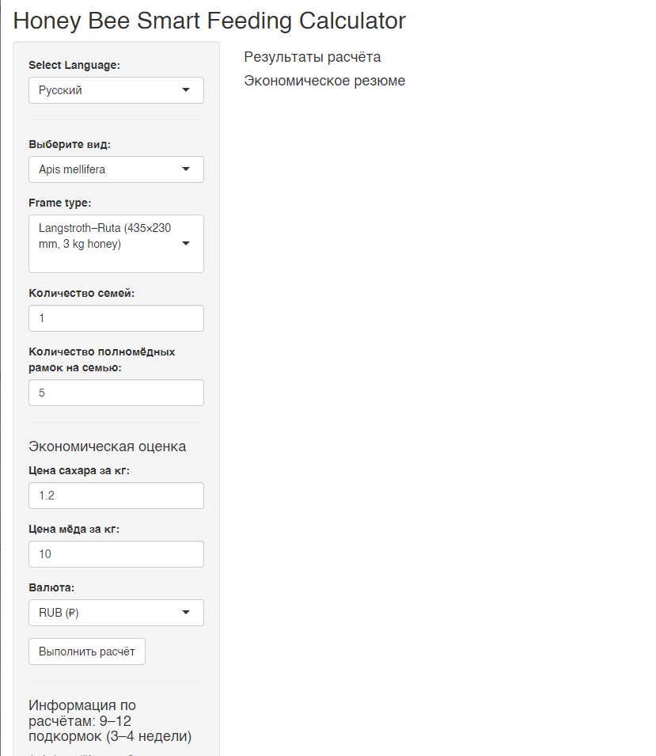
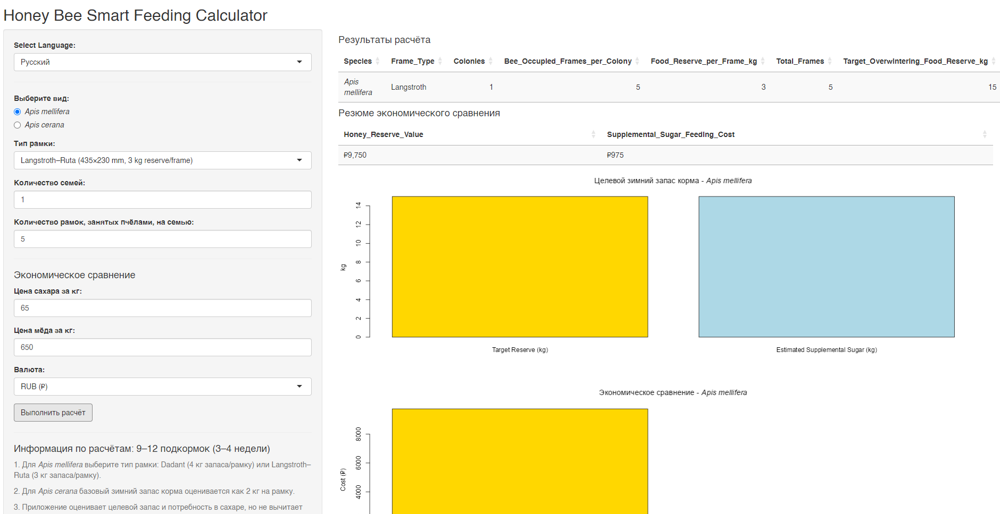

# Honey Bee Smart Feeding Calculator
# Инструмент поддержки принятия решений по предзимней подкормке пчелиных семей

## Обзор

**Honey Bee Smart Feeding Calculator** — это бесплатное интерактивное приложение на R Shiny, разработанное для оценки потребности пчелиных семей в кормовых запасах на зимовку и связанных с этим затрат на подкормку.

Приложение поддерживает два вида пчёл:

- *Apis mellifera*
- *Apis cerana*

Калькулятор позволяет оценить:
- целевой объём кормовых запасов для зимовки;
- потребность в сахарной подкормке на основе расчётных кормовых запасов;
- предполагаемые затраты на сахарную подкормку;
- рыночную стоимость эквивалентного количества медовых запасов;
- экономическое сравнение между стоимостью подкормки и стоимостью медовых запасов.
- 
Инструмент предназначен для:
- практического пчеловодства;
- образовательных целей;
- планирования зимовки;
- экономического сравнения вариантов зимней подкормки;
- научных и консультационных задач.

---

## Научное обоснование

Успешная зимовка пчелиных семей во многом зависит от достаточного количества кормовых запасов и соответствующей силы семьи перед зимним периодом. Стратегии подкормки варьируют в зависимости от вида пчёл, климатических условий, системы содержания и местных пчеловодческих традиций.

Honey Bee Smart Feeding Calculator был разработан как прозрачный и удобный инструмент для оценки:
- потребности в кормовых запасах на зимовку;
- потребности в сахарной подкормке на основе расчётных кормовых запасов;
- связанных затрат на подкормку;
- управленческих и экономических аспектов обеспечения зимних кормовых запасов.
  
Калькулятор использует видоспецифические нормативы кормовых запасов, основанные на опубликованных рекомендациях и практических руководствах по пчеловодству. Инструмент предназначен для поддержки принятия решений и не заменяет непосредственный осмотр семей или профессиональное мнение пчеловода.

Важно отметить, что калькулятор не предназначен для стимулирования замены натуральных медовых запасов сахарным сиропом. Его цель — помочь в принятии решений в ситуациях, когда зимних кормовых запасов недостаточно и требуется дополнительная подкормка.

---

## Установка

### 1. Установка R

https://cran.r-project.org/

### 2. Установка RStudio (необязательно)

https://posit.co/download/rstudio-desktop/

### 3. Установка необходимых пакетов

Для установки пакетов запустите файл:

“RUN1_pre.R”

### 4. Запуск приложения

Запустите файл "RUN2_app.R" в RStudio и нажмите:

Run App

или выполните команду:
 
shiny::runApp()

---

## Как использовать приложение

### Шаг 1 — Выбор вида пчёл

Выберите:

- A = *Apis cerana*
- B = *Apis mellifera*

### Шаг 2 — Ввод информации о семьях

Введите:

- количество рамок на семью,
- количество семей,
- цену сахара за кг,
- цену мёда за кг.

### Шаг 3 — Выполнение расчёта

Нажмите:

- Run calculation

Приложение рассчитывает:

- общий объём корма для зимовки,
- необходимое количество сахара,
- предполагаемые затраты на сахар,
- предполагаемую стоимость мёда.

### Шаг 4 — Просмотр результатов

Результаты отображаются в виде:

- таблиц,
- графиков.

---

## Принцип расчётов
Калькулятор использует следующие нормативы кормовых запасов для зимовки:

- *Apis cerana*	2 кг на рамку;
- *Apis mellifera* (Langstroth)	3 кг на рамку;
- *Apis mellifera* (Dadant)	4 кг на рамку.
  Эти значения представляют собой обобщённые ориентировочные показатели, основанные на практических рекомендациях по пчеловодству.

На их основе приложение рассчитывает:
- целевой объём кормовых запасов для зимовки;
- соответствующую потребность в подкормке.
Экономические показатели рассчитываются на основе введённых пользователем цен на сахар и мёд.
- Коэффициент экономической эффективности рассчитывается следующим образом:
Стоимость сахарной подкормки ÷ Стоимость медовых запасов
Этот показатель предназначен для сравнения различных вариантов управления кормовыми ресурсами и не должен рассматриваться как рекомендация по замене натурального мёда сахарным сиропом.

## Ограничения

Калькулятор предоставляет приблизительные оценки.
Текущая версия рассчитывает потребность в кормовых запасах на основе размера семьи и видоспецифических нормативов.
Фактические запасы мёда, уже находящиеся в семье, напрямую в расчёты не включаются и должны учитываться пользователем отдельно.
Кроме того, приложение не учитывает:
- региональные климатические различия;
- наличие медоносной базы;
- генетические особенности семей;
- наличие заболеваний;
- паразитарную нагрузку;
- качество матки;
- индивидуальные особенности зимовки семей;
- трудозатраты;
- колебания рыночных цен.
Поэтому результаты необходимо интерпретировать с учётом фактического состояния семей и полевых наблюдений.

---

## Устранение проблем

### Отсутствующие пакеты

Установите отсутствующие пакеты вручную:

install.packages("package_name")

### Старая версия R

Рекомендуется:

- R version ≥ 4.0

### Проверка установки Shiny

library(shiny)
runExample("01_hello")

Если пример запускается корректно, значит Shiny установлен правильно.

---

## Цитирование

Если вы используете данное программное обеспечение в научной работе, пожалуйста, цитируйте:

Frunze et al. (2026).
Honey Bee Smart Feeding Calculator Shiny App.
GitHub repository.

---

## Лицензия

Проект распространяется под лицензией GNU General Public License v3.0 (GPL-3.0).

---

## Отказ от ответственности

Данное программное обеспечение предназначено исключительно для образовательных целей и планирования.

Результаты расчётов являются приблизительными и не заменяют профессиональную оценку состояния пчелиных семей или непосредственный осмотр семей.

---

## Контакты

Prof. Hyung-Wook Kwon
E-mail: hwkwon@inu.ac.kr

PhD. Olga Frunze
Division of Life Science
Incheon National University
Republic of Korea
## Screenshots

### Main Interface

### Example Calculation

### Results for *Apis mellifera*

